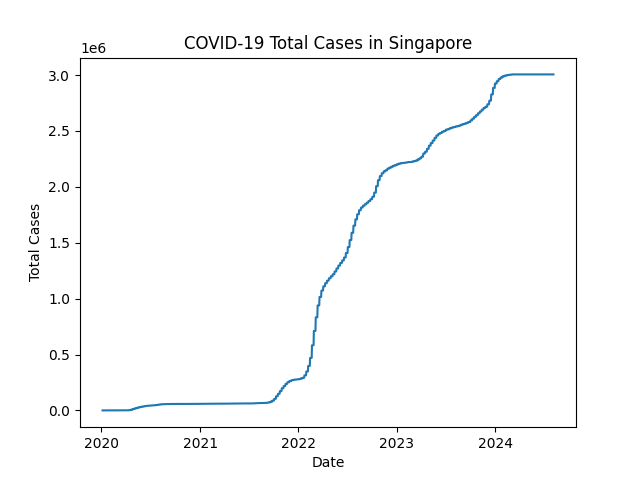
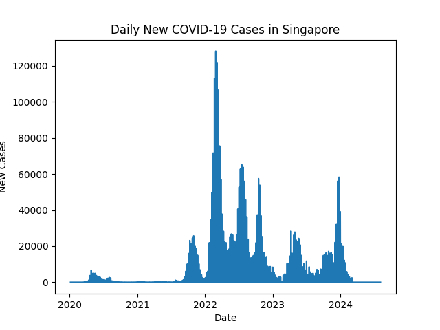
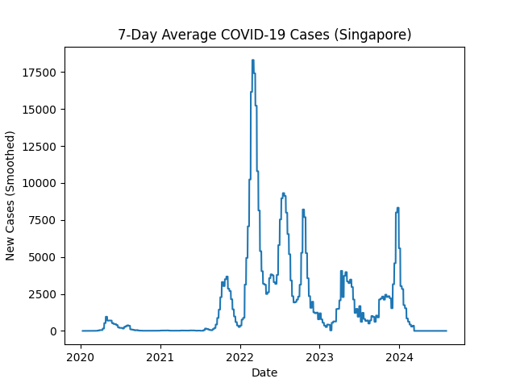
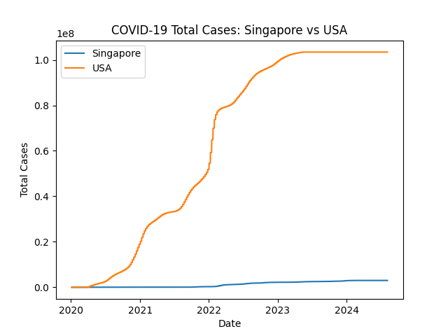

COVID-19 Data Analysis (Singapore with Comparative Reference)

Executive Summary

This project performs a time-series analysis of COVID-19 case data in Singapore, with the objective of characterizing cumulative growth, daily incidence patterns, and underlying temporal trends. The analysis applies data cleaning, transformation, and visualization techniques to extract interpretable insights from raw case data.

In addition to univariate analysis, a comparative visualization is included to provide contextual benchmarking against another country, enabling relative interpretation of scale and variability in case trajectories.

Problem Statement

The objective of this analysis is to:
	•	Understand cumulative growth of COVID-19 cases over time
	•	Characterize daily case variability and identify trends
	•	Detect wave-like patterns and temporal shifts
	•	Provide contextual comparison across regions
  
Approach

1. Data Preparation
	•	Loaded time-series dataset
	•	Standardized date formatting
	•	Handled missing and inconsistent values
	•	Derived cumulative and daily case metrics

2. Exploratory Data Analysis
	•	Analysed cumulative case progression
	•	Examined daily fluctuations and volatility
	•	Identified peaks, trends, and inflection points

3. Visualization
	•	Generated time-series plots for total and daily cases
	•	Applied smoothing techniques to reduce noise
	•	Created comparative visualization for contextual reference

Key Findings

	•	Cumulative case counts show sustained growth with identifiable wave patterns over time
	•	Daily case data exhibits high short-term volatility, requiring smoothing for clearer interpretation
	•	Smoothed trends reveal underlying directional movements that are not easily visible in raw daily data
	•	Comparative visualization highlights differences in scale and variability across regions

  Key Visualisations

Singapore: Total COVID-19 Cases
### Singapore: Total COVID-19 Cases


Singapore: Daily COVID-19 New Cases (Raw)
### Singapore: Daily New Cases (Raw)


Singapore: Daily COVID-19 New Cases (Smoothed)
### Singapore: Daily New Cases (Smoothed)


Country Comparison (Trend Reference)
### Country Comparison (Trend Reference)


Tools & Technologies

	•	Python
	•	Pandas
	•	Matplotlib
	•	Jupyter Notebook

Skills Demonstrated

	•	Time-series data analysis
	•	Data cleaning and preprocessing
	•	Feature derivation (cumulative vs daily metrics)
	•	Data visualization and storytelling
	•	Comparative analysis across datasets
	•	Interpretation of noisy real-world data

How To Run

## How to Run

```
git clone https://github.com/williamwong-data/covid-analysis.git
cd covid-analysis
jupyter notebook
```

Project Structure

## Project Structure

```
covid-analysis/
├── notebooks/
├── visuals/
├── sql/
├── README.md
└── .gitignore
```

Future Improvements

	•	Extend analysis to additional countries for broader comparison
	•	Incorporate per-capita normalization for more meaningful comparisons
	•	Build interactive dashboards using Plotly or Tableau
	•	Automate data ingestion and updates

Author

William Wong

Portfolio Note

This project demonstrates practical application of data analysis workflows, including data preprocessing, exploratory analysis, and visualization. It reflects the ability to derive insights from time-series data and communicate findings in a structured and interpretable manner.
